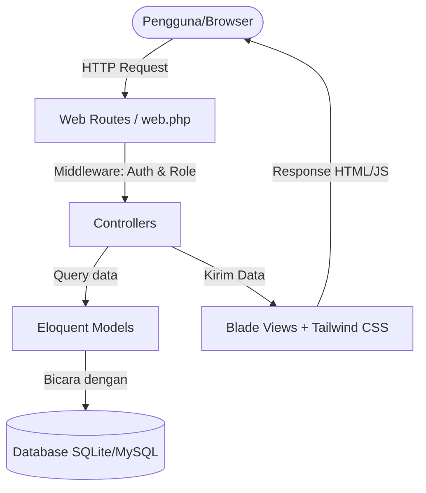
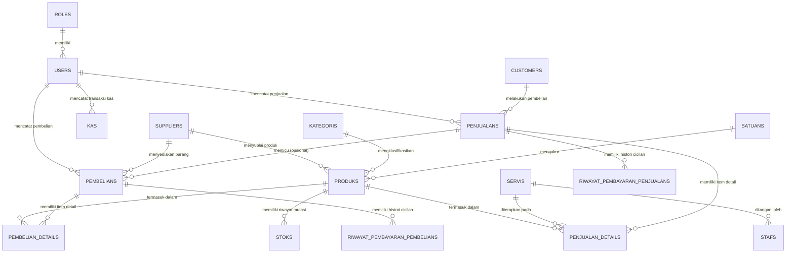
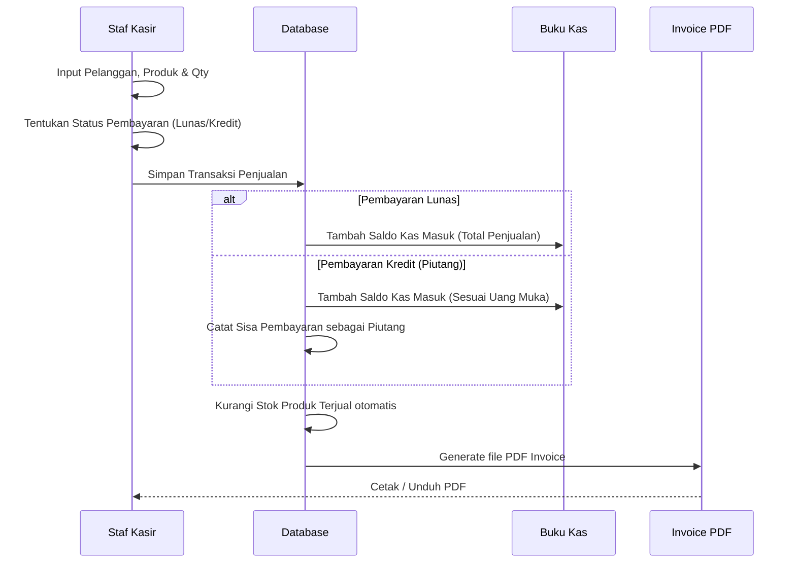
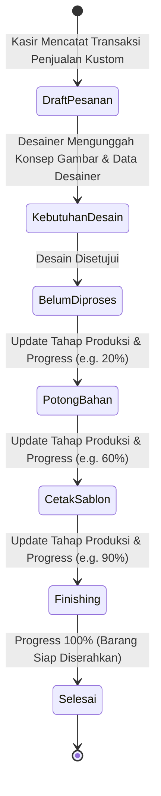

# 📑 Dokumentasi Teknis Sistem - Mudain Project ERP & POS

Selamat datang di Dokumentasi Teknis **Mudain Project**. Dokumen ini disusun untuk memberikan pemahaman menyeluruh tentang arsitektur sistem, skema database, sistem hak akses, alur kerja utama, serta struktur kode bagi developer, dosen penguji, maupun mahasiswa yang ingin mengembangkan atau mempelajari project ini.

---

## 🛠️ 1. Arsitektur Sistem

Mudain Project dibangun di atas framework **Laravel 13** dengan memanfaatkan pola arsitektur **MVC (Model-View-Controller)** yang sangat terstruktur, aman, dan mudah diskalakan.



*   **Routing & Middleware**: Memvalidasi status autentikasi pengguna (`auth` middleware) dan secara dinamis memetakan menu yang muncul berdasarkan hak akses (permission) yang dimiliki pengguna di database.
*   **Asset Bundling (Vite 6)**: Mengompilasi resource CSS (Tailwind) dan JavaScript secara modern, cepat, serta responsif, memastikan assets dimuat secara efisien saat production.
*   **Database Eloquent ORM**: Menggunakan ORM bawaan Laravel untuk memanipulasi database secara aman, menghindari serangan SQL Injection, dan mengelola relasi antar-tabel secara ekspresif.

---

## 💾 2. Skema Database & Relasi Model

Sistem ini memiliki skema database yang sangat komprehensif, mencakup 20+ tabel yang saling berelasi untuk mendukung modul POS, pembelian, keuangan, desain, produksi, dan audit trail.

### 📊 Diagram Relasi Entitas (ERD)

Berikut adalah visualisasi hubungan antar-tabel utama di dalam database:



### 📋 Deskripsi Tabel & Model Utama

1.  **`users`**: Menyimpan kredensial pengguna, status akun (Aktif/Nonaktif), serta relasi ke `role_id`.
2.  **`roles`**: Berisi nama peran (Owner, Sales, Desainer, dll.) dan kolom `permissions` berformat JSON/Array yang menyimpan daftar hak akses modular secara spesifik.
3.  **`produks`**: Data item utama yang diperjualbelikan. Menyimpan informasi gambar, kode barang, nama item, harga beli, harga jual umum, harga pelanggan (member), dan jumlah stok riil.
4.  **`stoks`**: Mencatat histori keluar-masuk barang (Stok In/Out) beserta tanggal, jumlah, nilai konversi, dan keterangan pendukung (audit mutasi barang).
5.  **`penjualans` & `penjualan_details`**:
    *   `penjualans` menyimpan data master transaksi: kode invoice, customer, total harga, jumlah bayar, kembalian, status pembayaran (Lunas/Kredit), serta kolom pendukung pesanan kustom seperti desainer, judul desain, dan gambar desain.
    *   `penjualan_details` menyimpan rincian item produk yang dibeli, kuantitas (qty), subtotal, servis/jasa eksternal yang dipilih, serta status produksi (`tahap_produksi`, `progress` 0-100%, `catatan_produksi`).
6.  **`pembelians` & `pembelian_details`**:
    *   `pembelians` mencatat pengadaan barang kepada supplier: kode faktur, supplier terkait, total harga, sisa hutang, tanggal jatuh tempo, dan status pembayaran. Kolom `penjualan_id` opsional diisi jika pembelian barang dipicu langsung oleh pesanan kustom pelanggan.
    *   `pembelian_details` mencatat barang apa saja yang dibeli dan harga beli pada saat transaksi dilakukan.
7.  **`riwayat_pembayaran_penjualans` & `riwayat_pembayaran_pembelians`**:
    *   Mencatat riwayat pembayaran angsuran untuk transaksi penjualan kredit (Piutang) dan pembelian tempo (Hutang).
8.  **`kas`**: Buku kas digital yang menampung arus uang masuk/keluar (Penjualan, Pembelian, Angsuran Hutang/Piutang, Pengeluaran Operasional non-transaksi) secara kronologis.
9.  **`activity_logs`**: Log audit sistem otomatis yang mencatat nama pengguna, aksi (create, update, delete), deskripsi modul, IP address, user agent, dan data lama vs data baru.

---

## 🔒 3. Sistem Otorisasi Granular (RBAC)

Aplikasi ini menggunakan pendekatan **Role-Based Access Control (RBAC)** yang fleksibel, dinamis, dan terintegrasi langsung dengan router Laravel.

### 🗝️ Mekanisme Autentikasi & Otorisasi
Hak akses didefinisikan dalam seeder (`RoleSeeder.php`) dalam bentuk string berpola `Nama Modul_Nama Fitur` (Contoh: `'Transaksi_Entry Penjualan'`, `'Keuangan_Kas'`).

*   **Wildcard `*`**: Pengguna dengan role **Super Admin / Owner** memiliki izin wildcard `*` yang secara otomatis mengizinkannya melewati semua pemeriksaan hak akses (Full Access).
*   **Pengecekan di Model User (`hasPermission`)**:
    ```php
    public function hasPermission(string $permission): bool
    {
        $perms = $this->role?->permissions ?? [];
        if (in_array('*', $perms)) {
            return true;
        }
        return in_array($permission, $perms);
    }
    ```

### 🗺️ Pengalihan Dashboard Dinamis (Dynamic Routing)
Saat pengguna berhasil login, Laravel akan mengarahkannya ke rute `/dashboard`. Rute ini merupakan "dispatcher" dinamis yang memeriksa izin yang dimiliki pengguna dan mengarahkannya ke halaman yang sesuai dengan tugasnya:

```php
Route::get('/dashboard', function () {
    $user = Auth::user();
    $perms = $user->role->permissions ?? [];

    if (in_array('*', $perms)) {
        return redirect()->route('admin.dashboard');
    }

    $routeMap = [
        'Transaksi_Entry Penjualan'  => 'admin.penjualan.entry',
        'Transaksi_Daftar Penjualan' => 'admin.penjualan.daftar',
        'Produksi_Update Produksi'   => 'admin.produksi.update-produksi',
        'Master Data_Data Produk'    => 'admin.data-produk.index',
        'Keuangan_Kas'               => 'admin.keuangan.kas',
        'Laporan_Laporan Penjualan'  => 'admin.laporan.penjualan',
        'Konten_Mitra'               => 'admin.konten.mitra',
        'User_Manajemen Pengguna'    => 'admin.user.pengguna',
    ];

    foreach ($routeMap as $perm => $routeName) {
        if (in_array($perm, $perms)) {
            return redirect()->route($routeName);
        }
    }

    Auth::logout();
    return redirect('/login')->with('error', 'Akun Anda belum diberikan akses modul.');
})->middleware('auth')->name('dashboard');
```

---

## 🔄 4. Alur Kerja Utama (Core Workflows)

### 🛒 A. POS (Penjualan) & Piutang



*   **Pengurangan Stok Otomatis**: Ketika kasir menekan tombol Simpan, sistem secara otomatis mengeksekusi operasi pengurangan jumlah stok pada tabel `produks` sesuai kuantitas penjualan.
*   **Riwayat Angsuran Piutang**: Untuk penjualan bertipe **Kredit**, Finance dapat membuka modul Piutang, memilih transaksi, menginput nilai pembayaran angsuran, yang kemudian akan mengurangi sisa piutang dan mencatatkan kas masuk baru ke tabel `kas`.

---

### 🎨 B. Workflow Produksi & Desain Pesanan Kustom

Project ini dirancang untuk menangani barang-barang kustom. Rantai kerjanya adalah sebagai berikut:



1.  **Entri Desain (Oleh Desainer)**: Melalui rute `/admin/produksi/update-desain`, desainer dapat mengunggah file konsep desain (`gambar_desain`), menginput judul, nama desainer, dan deskripsi khusus untuk dibaca tim produksi.
2.  **Pemantauan Kemajuan (Oleh Sales/Admin)**: Melalui rute `/admin/produksi/update-produksi`, staf produksi dapat memperbarui tingkat kemajuan (`progress` dalam persentase) serta mengubah `tahap_produksi` secara real-time. Informasi ini membantu divisi pelayanan pelanggan untuk memberikan update akurat ke pembeli.

---

### 💵 C. Pencatatan Keuangan & Laba Rugi Otomatis

Modul Keuangan beroperasi dengan mengonsolidasikan seluruh aktivitas moneter di dalam sistem:

*   **Pemasukan**: Didapat secara real-time dari pembayaran penjualan lunas, uang muka (DP) penjualan kredit, serta cicilan piutang yang masuk ke buku kas.
*   **Pengeluaran**: Bersumber dari pembayaran pembelian lunas ke supplier, pembayaran sisa hutang tempo, serta pencatatan manual biaya operasional non-transaksi (Contoh: Listrik, Gaji, Sewa Gedung) melalui fitur **Pengeluaran Lainnya**.
*   **Formula Laba Rugi**:
    $$\text{Laba Kotor} = \text{Total Penjualan} - \text{Harga Pokok Pembelian (HPP)}$$
    $$\text{Laba Bersih} = \text{Laba Kotor} - \text{Total Pengeluaran Lainnya (Operasional)}$$

---

## 📂 5. Struktur Direktori & Penjelasan Kode

Memahami struktur berkas membantu developer menemukan letak fungsionalitas dengan cepat:

### 📁 Controller (`app/Http/Controllers`)
Semua controller diorganisasikan ke dalam dua sub-namespace utama:
*   `App\Http\Controllers\Customer`: Menangani halaman profil depan pelanggan.
    *   `LandingPageController.php`: Halaman Beranda (Mitra, Testimoni, dll.)
    *   `TentangController.php`, `ProdukController.php`, `KontakController.php`
*   `App\Http\Controllers\Admin`: Menangani seluruh sistem administrasi ERP & POS.
    *   `DashboardController.php`: Agregasi data statistik & grafik penjualan.
    *   `ProductController.php`: Manajemen barang & logika **Import Excel**.
    *   `PenjualanController.php` & `PembelianController.php`: Logika inti transaksi POS, pencatatan kas, invoice PDF, dan mutasi stok.
    *   `KeuanganController.php`: Logika Buku Kas, Laba Rugi, dan pengeluaran operasional.
    *   `LaporanController.php`: Mengelola filter tanggal dan logika **Ekspor PDF & Excel**.

### 📁 Views (`resources/views`)
Layout dan UI dirancang dengan partisi modular menggunakan template engine Blade:
*   `layouts/`: Berisi base template (master view) untuk front-end dan panel admin.
*   `admin/layouts/navigation.blade.php`: Sidebar dinamis panel admin. Di dalam sidebar ini dilakukan pemeriksaan `@if(auth()->user()->hasPermission('...'))` untuk merender menu navigasi secara dinamis sesuai hak akses.
*   `admin/master-data/`: Kumpulan halaman pengelolaan entitas dasar (satuan, kategori, produk, supplier, customer).
*   `admin/transaksi/`: Kumpulan view kasir penjualan, pembelian, kartu hutang, dan piutang.

---

## ⚙️ 6. Panduan Operasional & Pengembangan (SOP)

### 🆕 A. Prosedur Menambahkan Fitur / Modul Baru
Jika Anda ingin menambahkan sebuah modul baru (Contoh: Modul *Asset Management*), ikuti alur standar Laravel berikut:

1.  **Buat Migration & Model**:
    ```bash
    php artisan make:model Asset -m
    ```
    *Definisikan struktur kolom di file migration baru di database/migrations/, lalu jalankan `php artisan migrate`.*

2.  **Buat Controller**:
    ```bash
    php artisan make:controller Admin/AssetController --resource
    ```
    *Tulis fungsionalitas CRUD di dalam Controller tersebut.*

3.  **Daftarkan Rute**:
    Buka `routes/web.php` dan daftarkan rute baru Anda di bawah grup middleware `auth`:
    ```php
    Route::resource('/admin/master-data/asset', AssetController::class)->names('admin.asset');
    ```

4.  **Daftarkan Hak Akses Baru (Opsional)**:
    Jika ingin membatasi modul ini, daftarkan permission baru di `RoleSeeder.php` (Contoh: `'Master Data_Data Asset'`), jalankan ulang seeder (`php artisan db:seed --class=RoleSeeder`), lalu tambahkan kondisional di sidebar navigasi:
    ```blade
    @if(auth()->user()->hasPermission('Master Data_Data Asset'))
        <a href="{{ route('admin.asset.index') }}">Asset Management</a>
    @endif
    ```

### 📥 B. Prosedur Import Excel & Export PDF
*   **Ekspor PDF**: Menggunakan package `barryvdh/laravel-dompdf`. Pastikan gambar/CSS yang dimuat di view cetak menggunakan absolute path (gunakan helper `public_path()` atau asset base64) agar file PDF dapat ter-render dengan sempurna tanpa kendala pemuatan asset.
*   **Impor Excel**: Menggunakan library `maatwebsite/excel`. Pastikan format file Excel yang diunggah sesuai dengan templat kolom yang diharapkan di controller (`ProductController::class` pada metode `importExcel()`).

---

<p align="center">
  Jika Anda menemui kendala dalam pengembangan atau integrasi, silakan jalankan modul pengujian bawaan dengan perintah:<br>
  <code>php artisan test</code> atau <code>npm run test</code>
</p>
